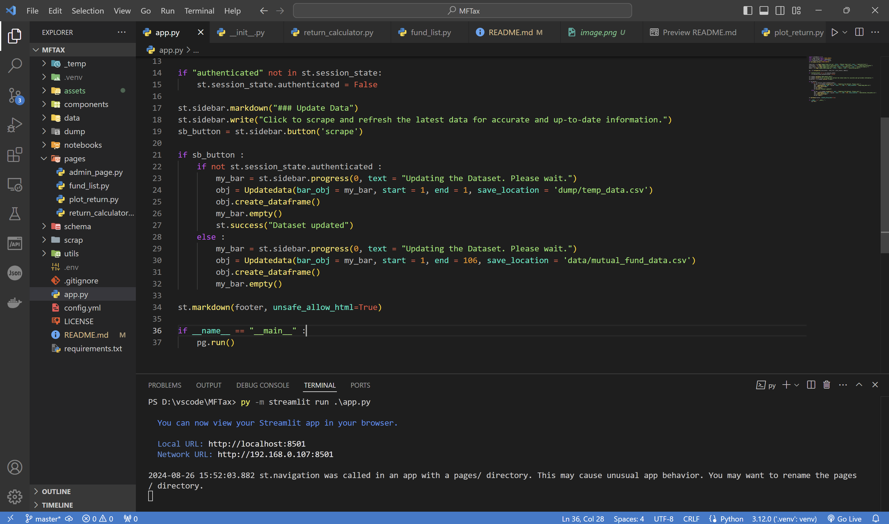

# FundFinder

**FundFinder** is a powerful and intuitive Streamlit app designed to help investors select the best mutual funds by providing detailed comparisons and insights. The app scrapes mutual fund data from the internet, calculates returns before and after taxes, and compares funds based on their performance and expense ratios. It also visualizes the data to aid in making informed investment decisions.


## Features

- **Fund Data Scraping**: Automatically fetch mutual fund details from the internet.
- **Return Calculations**: Compute actual returns before and after taxes.
- **Expense Ratio Comparison**: Compare different funds based on their expense ratios.
- **Interactive Visualization**: Plot charts to visualize fund performance and comparisons.
- **AI-Generated Insights**: Receive a pros and cons analysis of the selected fund on the plot return page.
- **User-Friendly Interface**: Built with Streamlit for a seamless user experience.

## Installation

To set up FundFinder, you need to have Python and Streamlit installed. Follow these steps to get started:

1. **Clone the Repository**:

   ```bash
   git clone https://github.com/yourusername/FundFinder.git
   cd FundFinder
   ```

2. **Create and Activate a Virtual Environment** (optional but recommended):

   ```bash
   python -m venv venv
   source venv/bin/activate  # On Windows use `venv\Scripts\activate`
   ```

3. **Install Required Packages**:

   ```bash
   pip install -r requirements.txt
   ```

4. **Set up AI Features**:

   You can customize the AI-generated insights by adding your `GROQ_API_KEY` and specifying the model name in the `.env` file. The AI model currently used is `GROQ_LLama`. To set up, update the `.env` file like this:

   ```bash
   GROQ_API_KEY=your_api_key
   GROQ_LLama=model_name
   ```

## Usage

1. **Run the Streamlit App**:

   ```bash
   streamlit run app.py
   ```

2. **Interact with the App**:
   - **Fund Selection**: Browse through the list of mutual funds.
   - **View Fund Details**: See detailed information about each fund.
   - **Compare Funds**: Analyze and compare different funds based on returns and expense ratios.
   - **Visualize Data**: View charts that illustrate fund performance.
   - **AI Insights**: On the plot return page, get AI-generated pros and cons analysis of the selected fund.



## Project Structure

```
|---_temp 
|   |-- config.py
|
|---components 
|   |-- footer.py
|
|--- data 
|   |-- mutual_fund_data.csv
|
|--- dump 
|   |-- temp_data.csv
|
|--- notebooks 
|   |-- test.ipynb
|
|--- pages 
|   |-- admin_page.ipynb
|   |-- fund_list.ipynb
|   |-- plot_return.ipynb
|   |-- return_calculator.ipynb
|
|--- schema 
|   |-- LLM_output.py
|
|--- scrap 
|   |-- scrape.py
|
|--- utils 
|   |-- calculate_return.py
|   |-- auth.py
|   |-- generate_response.py
|
|--- app.py 
|--- .env 
|--- config.yml 
|--- .gitignore 
|--- LICENSE
|--- README.md 
|--- requirements.txt
```

## Requirements

- Python 3.7 or higher
- Streamlit
- pandas
- numpy
- requests (for web scraping)
- BeautifulSoup (for parsing HTML)
- Groq API (for AI-generated insights)

## License

This project is licensed under the MIT License. See the [LICENSE](LICENSE) file for details.

## Contributing

Contributions are welcome! Please fork the repository and submit a pull request with your changes. For major changes, please open an issue first to discuss what you would like to change.

## Contact

For any questions or feedback, please reach out to [work.soumyadipghorai@gmail.com](mailto:work.soumyadipghorai@gmail.com).

---

Happy Investing!
